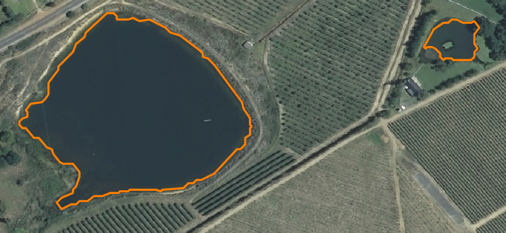

# satalite-image-water-body-finder


Authors _S.R.K Gasson & D.S Geldenhuys_

satelite-image-water-body-finder is a computer vision system that detects and delineates water bodies using a random forest classifier at its core. Given an input geo-referenced '.tif' file, the vission system generates '.geojson' files that conatin feature polygons that delineate waterbodies.

## Getting Started

These instructions will get you a copy of the project up and running on your local machine for development and testing purposes. See deployment for notes on how to
deploy the project on a live system.

### Prerequisites

For installation on Windows:

Before installing, it is required to install the following windows binaries:

- Gdal
- Rasterio
- Shapely

These can all be downloaded from the following link:

https://www.lfd.uci.edu/~gohlke/pythonlibs/

Use ctr+f to search through the windows binaries on this page and locate the wheels. Select the correct version for your environment. The first in the list is typically the latest and correct version.

To install the wheels, create an environment (== python 3.8) using [venv](https://docs.python.org/3/tutorial/venv.html) or [anaconda](https://docs.conda.io/projects/conda/en/latest/user-guide/tasks/manage-environments.html#creating-an-environment-with-commands) and run the following from within your environment for each wheel:

```
pip install <path-to-wheel>
```

For example:

```
pip install C:\wheels\GDAL-3.0.4-cp38-cp38-win_amd64.whl
pip install C:\wheels\rasterio-1.1.3-cp38-cp38-win_amd64.whl
pip install C:\wheels\Shapely-1.7.0-cp38-cp38-win_amd64.whl
```

### Installing

Once these wheels are installed, run the following from within the root of the cloned repository to install dependencies and the water_body_finder package:

```
pip install .
```

See the demo.py file for an example of how to use the water_body_finder package.
